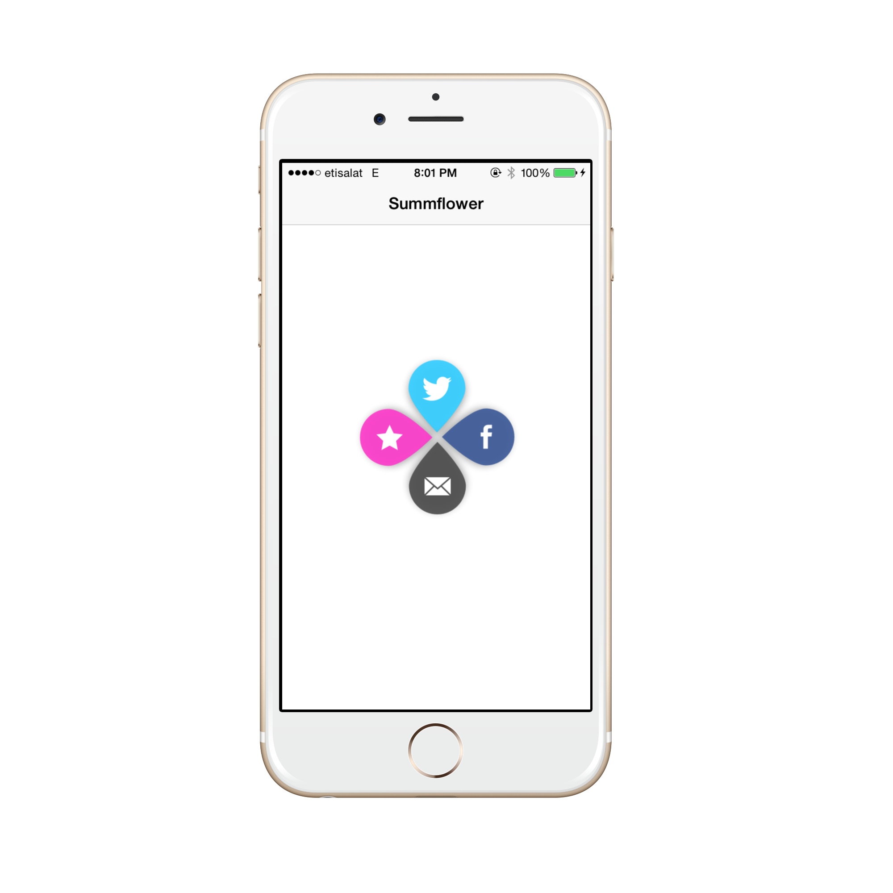

Summflower
=========

**Summflower is a swift implementation to the sexiest sharing icon based on [Summly] (http://www.summly.com/index.html) app.**

Overview
-----
Summflower is elgant and beatiful sharing icon, jsut long Press anwhere to reveal Summflower which allow for sharing.

Installation
-----

**Source files**

* Just clone this repository or download it in zip-file.
* Then you will find source files under **SummflowerControl** directory.
* Copy them to your project.

Usage
-----
`SummflowerViewController` is created and displayed in a very similar manner to the `UITableViewController`. To use `SummflowerViewController` you need create an instance, configure it, display it and implement the delegate methods.

An example of creating and displaying a `SummflowerViewController` instance:

- Declare your controller to conform to the SummflowerViewDataSource and SummflowerViewDelegate

        class ViewController: UIViewController,SummflowerViewDataSource,SummflowerViewDelegate	

- Initialize the control

        // Configure the Flora control and add to view controllers view.
        summflowerControl = SummflowerViewController(frame: CGRectMake(0, 0, self.view.frame.size.width, self.view.frame                                                               .size.height))
        summflowerControl.setDelegateAndDataSource(self, delegate: self)

- Implement the required methods of the data source 

         func floraView(floraView: AnyObject, numberOfRowsInSection section: Int) -> Int{
                return self.summflowerData.count
            }
            
        func floraView(floraView: AnyObject, itemForRowAtIndexPath indexPath: NSIndexPath) -> SummflowerSegment{
            var dicForSegment:NSDictionary = self.summflowerData.objectAtIndex(indexPath.row) as NSDictionary
            var imageName: NSString = dicForSegment.objectForKey("image")! as NSString
            var floraSegment:SummflowerSegment = SummflowerSegment()
            floraSegment.initWithImage(UIImage(named: imageName)!)
            return floraSegment
        }

- Implement the optional delegate method to be notified when a new item is selected

       // Called before the user changes the selection. Return a new indexPath, or nil, to change the proposed selection.
        optional func floraView(tableView: AnyObject, willSelectItemAtIndexPath indexPath: NSIndexPath) -> NSIndexPath?
        
      // Called after the user changes the selection.
      optional func floraView(tableView: AnyObject, didSelectItemAtIndexPath indexPath: NSIndexPath)                                   
      //Called after the animations have completed
      optional func floraView(tableView: AnyObject, didFinishExpandingAtPoint point: CGPoint)
      optional func floraView(tableView: AnyObject, didFinishCollapsingAtPoint point: CGPoint)
      
      optional func floraView(tableView: AnyObject, didFinishExpandingSegment segment: SummflowerSegment)
      optional func floraView(tableView: AnyObject, didFinishCollapsingSegment segment: SummflowerSegment)
    

Configuration
----------

Change the appearance of Summflower control by changing the constants in <code>SummflowerViewController</code>:

        //Segment Constants Properties.
        let SegmentAlpha:CGFloat = 0.96
        let SegmentShadowColor = UIColor.darkGrayColor()
        let SegmentShadowOffset = CGSizeMake(0, 3)
        let SegmentShadowOpacity:Float = 0.6
        let SegmentShadowRadis:CGFloat = 4
        let SegmentWidth:CGFloat = 60.0
        let SegmentHeight:CGFloat = 80.0
        
        //Animation Constants.
        let AnimationSegmentSpread:CGFloat = 1.003  //parameter for determining how crowded segments are with respect to each                                                          other
        let AnimationSegmentMinScale:CGFloat = 0.001 //Scale of the item at its smallest (i.e 0.01 is 1/100th its original size
        let AnimationGrowDuration:NSTimeInterval = 0.3
        let AnimationSegmentMaxScale:CGFloat = 1000 //Scale of the item at its largest (relative to on kAnimationPetalMinScale)
        let AnimationSegmentDelay:CGFloat = 0.1 //The amount of time between animating each segment
        
        let AnimationFanOutDegrees:Double = 360.0 //Amount  for the control to fan out 360 = fully fanned out, 180 = half                                                              fanned out
        let AnimationRotateDuration:NSTimeInterval = 0.3

Requirements
----------
* iOS 7.0 or higher
* ARC

## License
Panorama is released under the MIT license. See
[LICENSE](https://github.com/iSame7/Summflower/blob/master/LICENSE.md).

Contact
----------

Sameh Mabrouk

[mabrouksameh@gmail.com][2]

[@same7mabrouk][3] 

  [2]: mailto:mabrouksameh@gmail.com
  [3]: http://twitter.com/same7mabrouk
